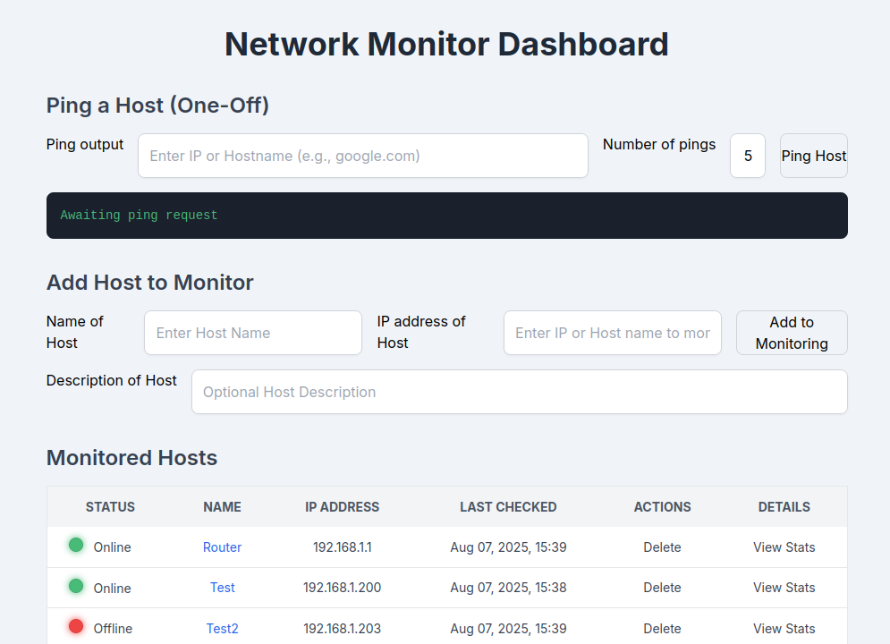
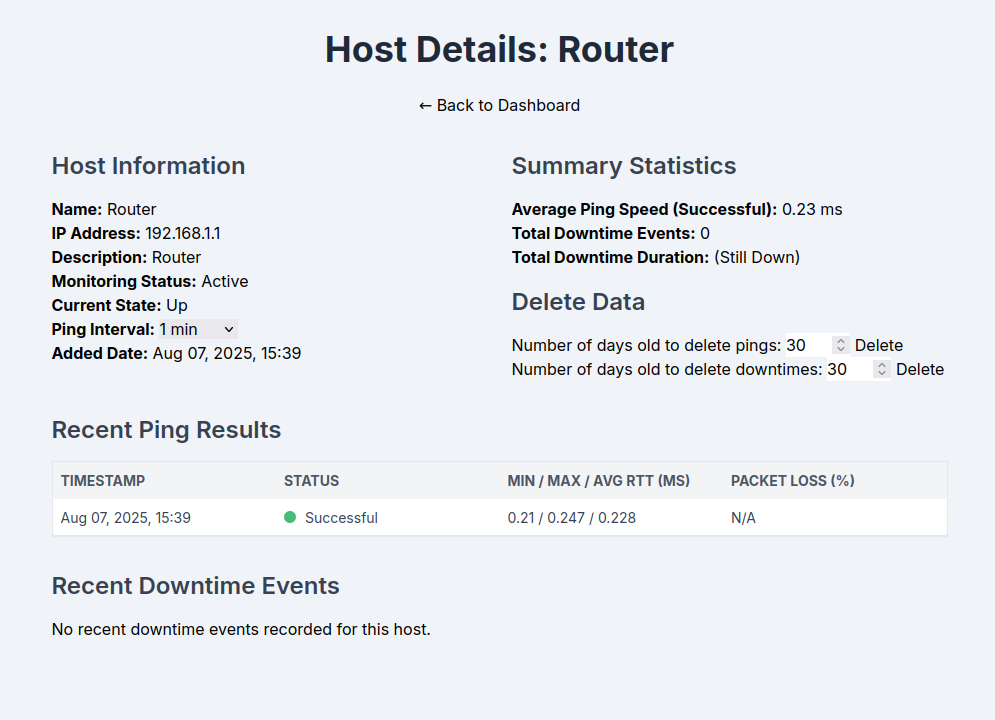

# Basic Network Monitoring Program

This is just a basic monitoring program I wrote with A LOT of help from Gemini AI. 

It does the following:
* Ping hosts with an option for number of pings.
* Add hosts to monitor. Needs host name and IP, with optional description.
* In the Host Detail page, there is four options:
  * Change monitoring status.
  * Update ping frequency.
  * Delete specified number of pings.
  * Delete specified number of downtimes.

This was my first attempt at a full stack program. A lot of learning to get it done. Uses Django, JavaScript, Python, HTML and CSS.

It does come with Docker settings etc to get it running to test it inside a docker image.

I will leave setting up docker and the setup to whomever is testing this. You need to create a .env file in the root dir. Use the
following template. Make sure you create passwords/usernames for the build to work.
```
# Django settings
DJANGO_SECRET_KEY=Some_Super_Secret_Password
DJANGO_DEBUG=False

# PostgreSQL Database Settings
DB_NAME=Name_Of_Database
DB_USER=Your_Username
DB_PASSWORD=Another_Super_Secret_Password
DB_HOST=db
DB_PORT=5432

# PostgreSQL Docker image settings (REQUIRED)
POSTGRES_DB=Name_Of_Database
POSTGRES_USER=Your_Username
POSTGRES_PASSWORD=Yet_Another_Password

REDIS_URL=redis://redis:6379/0
```
To build it run `docker compose up --build`. That should be all you need to do.



